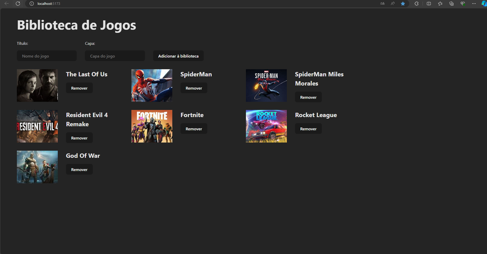
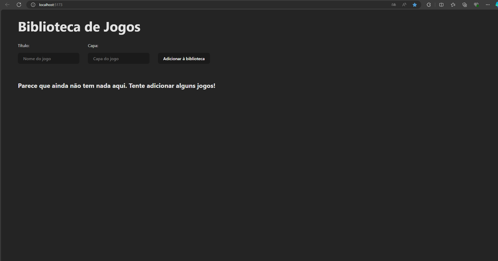
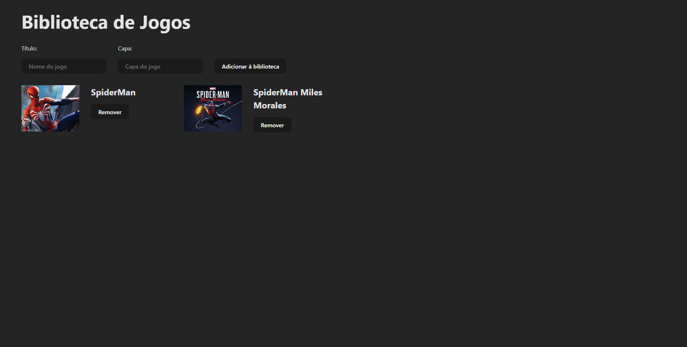
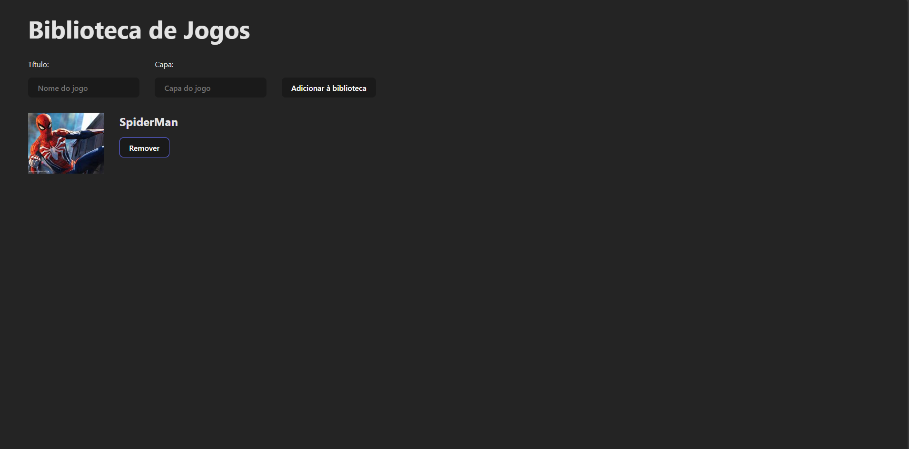

<h1 align="center" style="font-weight: bold;">Library Games 🎮</h1>

 <a href="#descrição">Descrição</a> • 
 <a href="#tecnologias-utilizadas">Tecnologias utilizadas</a> • 
 <a href="#instalação">Instalação</a> • 
 <a href="#uso">Uso</a> •
 <a href="#contribuição">Contribuição</a> •
 <a href="#contribuidores">Contribuidores</a> •
 <a href="#licença">Licença</a> 

    

## Descrição

A Library Games foi um projeto desenvolvido com o objetivo de adicionar e remover jogos em sua biblioteca, com armazenamento de dados utilizando o LocalStorage, e possuindo uma funcionalidade totalmente dinâmica que foi desenvolvida utilizando React. A finalidade deste projeto foi para praticar o uso de React, utilizando seus conceitos fundamentais em um desenvolvimento web.

## Tecnologias utilizadas:

- Node.js.
- React.
- JavaScript.
- CSS.

## Instalação

### Pré requisitos

- Node.js

## Uso

### Clonando repositório:

    git clone https://github.com/davivaldez/LibraryGames.git

### Alterando diretório:

    cd LibraryGames/

### Instalando dependências do package.json:

    npm install

### Inicializando a aplicação:

    npm run dev

### Tela Inicial

    

### Adicionando um jogo

#### Coloque o título do jogo e uma URL da capa do jogo e clique em "Adicionar à biblioteca"

    

### Removendo um jogo

#### Clique em "Remover" para remover o jogo da biblioteca

    

## Contribuição

Contribuições são bem-vindas! Siga as etapas abaixo para contribuir com o projeto:

1. Faça um **Fork** no repositório.
2. Crie uma **branch** para sua funcionalidade ou correção de bug: `git checkout -b minha-nova-funcionalidade`.
3. Faça um **Commit** para suas mudanças: `git commit -m 'Adicionando nova funcionalidade'`.
4. Faça um **Push** para a branch criada: `git push origin minha-nova-funcionalidade`.
5. Abra um **Pull Request**.

Obrigado por contribuir!

## Contribuidores

Atualmente, este projeto é mantido por um único contribuidor:

<table>
  <tr>
    <td align="center">
      <a href="https://github.com/davivaldez">
         
        

          <b>Davi Valdez</b>
        

      </a>
    </td>
  </tr>
</table>

Embora eu seja o único contribuidor até o momento, este projeto é aberto para contribuições da comunidade. Se você estiver interessado em contribuir, siga as instruções na seção de [Contribuição](#contribuição). Obrigado pelo seu interesse!

## Licença

Este projeto está licenciado sob a [MIT licensed](./LICENSE).
